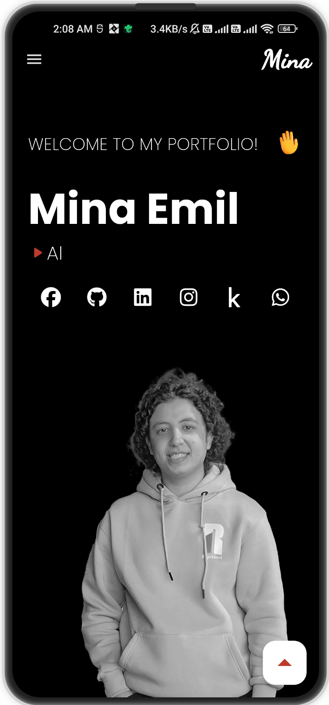
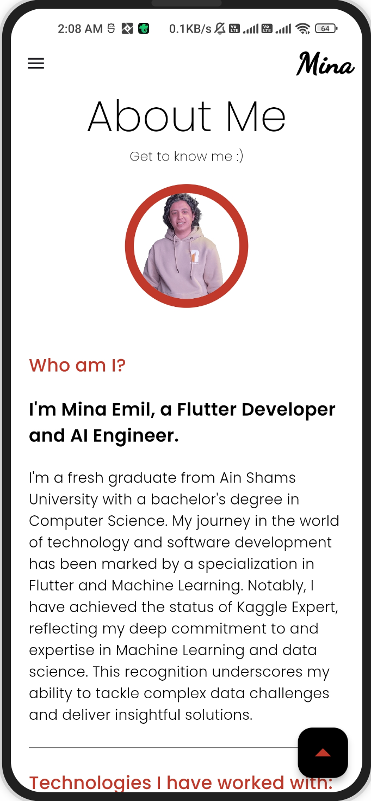
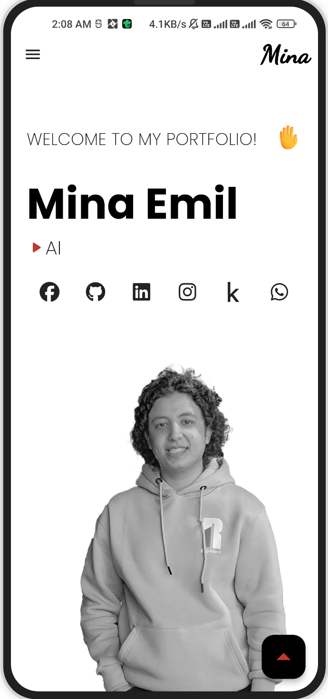
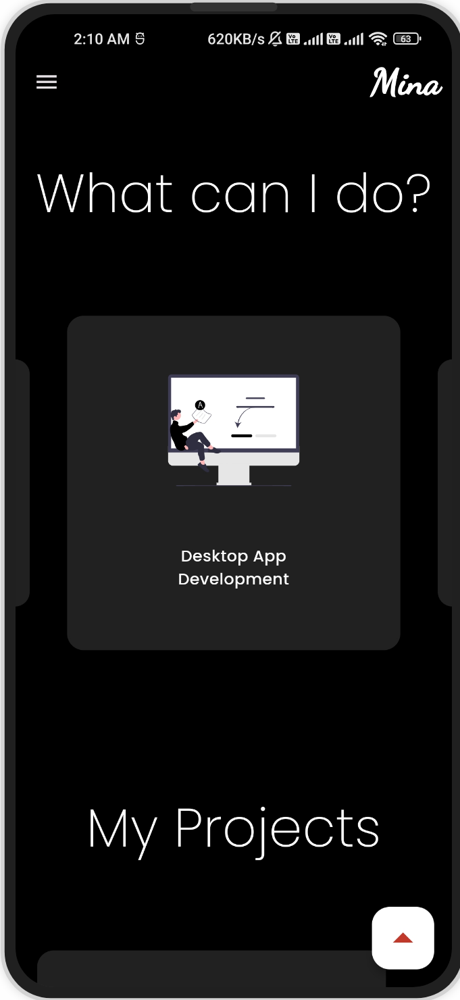
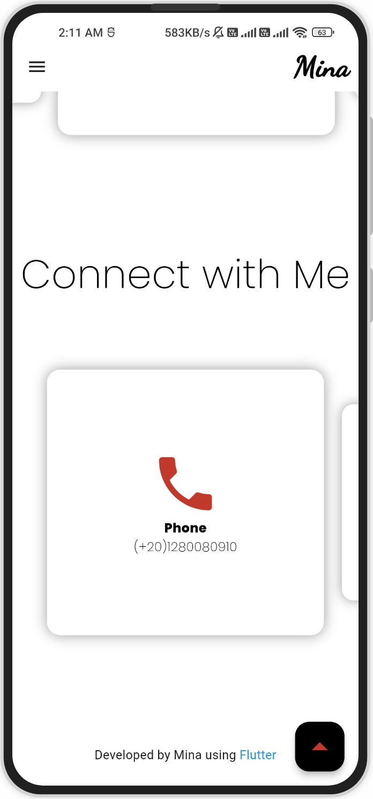
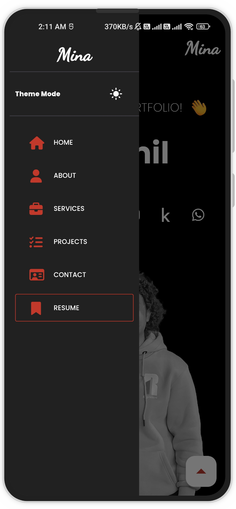

  
  <h1>Mina Portfolio</h1>

  

## Table of Contents

- [Introduction 🏛️](#introduction-🏛️)
- [Links 🚀](#links-🚀)
- [Demo 🎬](#demo-🎬)
- [Features 🌟](#features-🌟)
- [Screenshots 📸](#screenshots-📸)
- [Packages Used 📚](#packages-used-📚)
- [Author](#team-section)

  

## Introduction 🏛️

Welcome to Mina Portfolio, a cross-platform, open-source project designed to showcase my services, projects, and contact information. Developed with Flutter, this portfolio exemplifies the versatility and capability of modern application development.

  

## Links 🚀

🌐 Web App: https://mina329.github.io/portfolio/

📱 Android App: https://play.google.com/store/apps/details?id=com.mina329.portfolio

  

## Demo 🎬

https://github.com/Mina329/portfolio/assets/96777964/58cf030a-2580-490a-9f09-531f8ffae5e2

  

## Features 🌟

- Responsive & Adaptive UI
- Clean Architecture
- Light & Dark Theme

  

## Screenshots 📸

<table>
  <tbody>
    <tr>
      <td align="center"></td>
      <td align="center"></td>
      <td align="center"></td>
    </tr>
    <tr>
      <td align="center"></td>
      <td align="center"></td>
      <td align="center"></td>
    </tr>
    <tr>
      <td align="center"></td>
    </tr>
  </tbody>
</table>

  

## Packages Used 📚

The app utilizes several packages to enhance its functionality. Some of the key packages used include:

- carousel_slider
- cupertino_icons
- expandable_page_view
- flip_card
- flutter_svg
- font_awesome_flutter
- icons_launcher
- url_launcher
- window_manager

These packages are crucial for enabling various functionalities and enhancing the app's capabilities.

  

  <h1 align="center">Meet the Visionary Mind Behind the Project 🌟</h1>

  <table align = "center">
    <tr>
      <td align="center"><a href="https://github.com/mina329"></td>
    </tr>
  </table>

  <h2>About Me:</h2>
  <ul>
    <li><strong>Name:</strong> Mina Emil</li>
    <li><strong>Role:</strong> Flutter Developer</li>
    <li><strong>Passion:</strong> Crafting applications that seamlessly blend functionality and aesthetics.</li>
  </ul>
<h2>Connect with Me:</h2>
  
 Feel free to reach out if you have any questions, suggestions or just want to say hello! You can contact me at
    <a href="mailto:mina.emil.fakhry@outlook.com">mina.emil.fakhry@outlook.com</a>.

  

